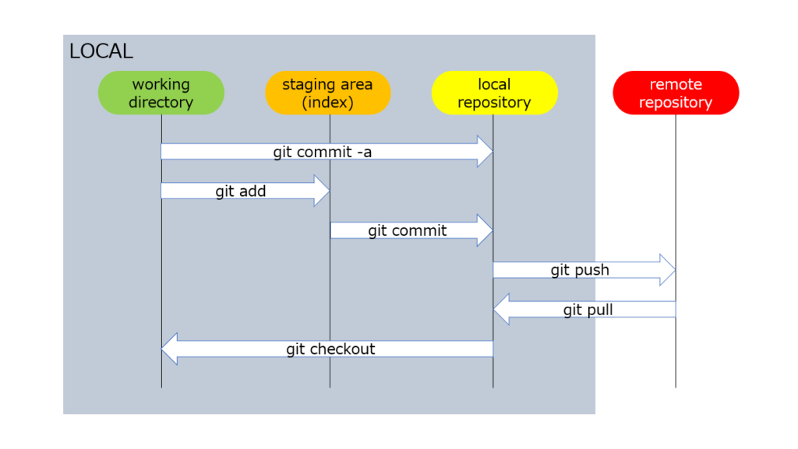

#  Git / Version Control Refresher 

## Links
- [Git Documentation & Reference Guide](https://git-scm.com/docs)

## <span style="color: yellow;">Configuration</span>
While using a GUI like [GitKraken](https://gitkraken.com) can make things easier and help in visualizing workflows, comfort on the command line is extremely important.

```$ git config``` : allows one to configure options for a local repository or the global functionality of git itself.
* <span style="color: red;">.git/config</span> : specific to each local repository maintains specific configurations to that specific repo.
* <span style="color: red;">~/.gitconfig</span> : is the file containing the configuration of git _globally_.
* <span style="color: orange;">Aliases</span> can be set-up within these files as well:

    

    * This command would be invoke using  ```$ git hist```.
    * Arguements can be passed to aliases, they are appended to the end of the command.

* <span style="color: red;">.gitignore</span> files set up within a repository allow for information / files to be hidden or untracked by git.
    * Ignoring files / folders:
        * Using the filename itself: <span style="color: red;">_myfile.txt_</span>
        * Using a wildcard / pattern: <span style="color: red;">_*.log_</span> 
        * The contents of a folder: <span style="color: red;">_my-directory/_</span>

## <span style="color: yellow;">Creating & Accessing Projects</span>
Repositories can be set-up in a few ways:
1. On the creation of a new directory
    * ```$ git init <directory_name>```
2. Initializing a repository while in an existing directory
    * ```$ git init```
3. Cloning an existing repository
    * ```$ git clone <github.com/link>```

It is important to be mindful that initializing a repository only need occur once in the main / root directory of a project. Things can get messy if sub-directories are also initlized.

## <span style="color: yellow;">Comparing & Inspecting Changes</span>
* ```$ git status```
* ```$ git diff```
* ```$ git log```


## <span style="color: yellow;">Adding & Commiting</span>
Git as a version control environment can be thought of as 4 distinct areas:



The ```working directory``` can be thought of as the region where change takes place. Any work performed here must deliberately added / tracked in order to save its state. The ``` staging area``` are where these changes are prepared to be saved. The staging area can be viewed as a holding location for where the changes we have made are acknowledged as what we would like to commit. Upon making this commit, these changes are recorded as a snapshot in the project's timeline of the ```local repository```. These changes are represented by a commit hash and a message we provide to illustrate what we accomplished.

* ```$ git add <filename>``` - adds file(s) to the staging area.
* ```$ git add .``` - adds all changes to the staging area.
* ```$ git commit -m "message"``` - commits staged changes to the local repository.
    * Commiting without the use of the ```-m``` flag and a message will open the text editor (if configured) to allow for a more detailed / longer commit message.
* ```$ git commit -am "message"``` - adds & commits inline.

The fourth area of the version control environment is the ```remote repository``` (i.e. GitHub). This external repository allows for us to back-up our projects, share our work, and collaborate with others.

## <span style="color: yellow;">Branching & Merging</span>
It may be appropriate to work directly on the main / master branch of a project if you are the only one contributing to it. However, as the scale of a project and the number of contributors working on it grows, it becomes increasingly important to pay attention to branching and the overall workflow.

***Branching*** allows for isolating segments of work while preserving the codebase. This allows for the freedom to experiment and try new things without the fear of destroying the time and effort already put into a project.

* Creating branches:
    * ```$ git branch <branch_name>``` - only creates the branch, doesn't switch to it.
    * ```$ git checkout -b <branch_name>``` - creates branch and switches to it.
    * ```$ git switch -c <branch_name>``` - newer way to create branch and switch to it.
        * Came about as _checkout_ is seen as being overloaded considering its other functionality.
* Viewing existing branchs in a repository:
    * ```$ git branch``` - shows local branches.
        * Using the ```-a``` flag will show remote branches as well.
* Changing branches:
    * ```$ git switch <branch_name>```
    * ```$ git checkout <branch_name>```

***Merging*** allows for work from one branch to be incorperated (_merged_) into another branch. To do so, one must navigate to the branch in which they wish to add changes to and then call for the merge of the other branch. For example, navigating to the _main_ branch which contains our functioning application and then merging a feature branch which contains the code of some addition we wish to include. ```$ git merge <branch_name>```

Merges can confound the commit history and the approach to merging can vary (i.e. Fast-forward merges, merge commits, etc.).

## <span style="color: yellow;">Updating & Sharing</span>

